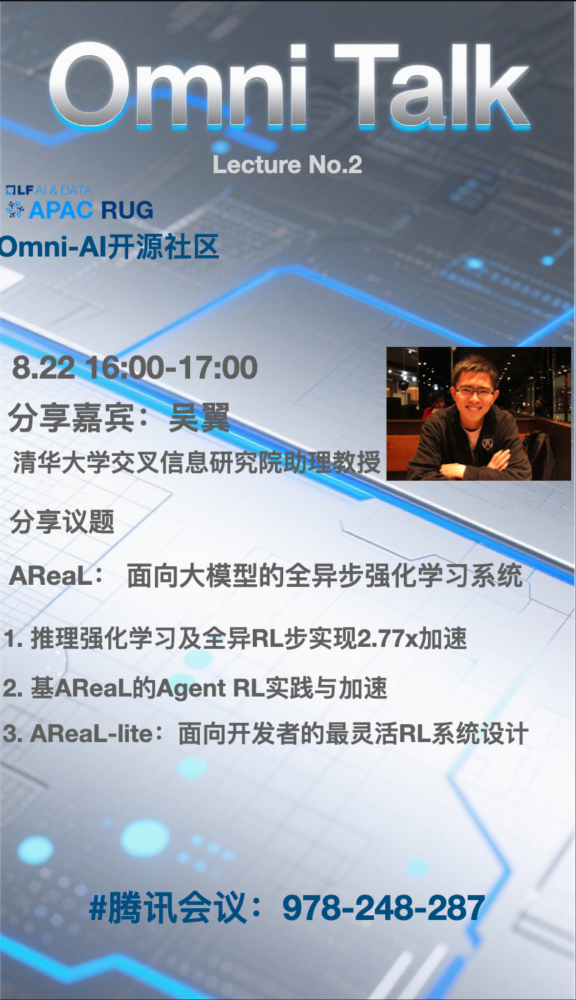

<!-- TOC -->

- [Omni-AI社区活动](#Omni-AI社区活动)
    - [业界会议参与](#业界会议参与)
    - [社区Webinar](#社区Webinar)
    - [社区Meetup](#社区Meetup)

<!-- /TOC -->

# Omni-AI社区活动

## 业界会议参与

- [GOSIM中国峰会](https://hangzhou2025.gosim.org/)
- [CCF开源大会](https://mp.weixin.qq.com/s/oodENT3IDfK483OhgOu7kg)：2025年8月2-3日
- [OpenInfra苏州Meetup](https://mp.weixin.qq.com/s/oPffGb_DK7uK40AW8s0_jA)：2025年7月5日

## 社区Webinar

Omni-Talk是Omni-AI社区联合LFAI&Data基金会亚太区域用户组共同举办的在线技术分享活动。

### 第一期：流水线并行研究

### 第二期：异步RL框架AReaL

## 社区Meetup

### 社区第二次Meetup————vLLM Shenzhen Meetup

社区联合LFAI&Data基金会亚太区域用户组，与腾讯公司团队一起，将于8月30日在深圳腾讯大厦，组织首次vLLM社区深圳地区Meetup，目前[活动的CFP](https://mp.weixin.qq.com/s/RDZgBqbWN3CX1Pdmo3aeLg?scene=1)已经上线

### 社区第一次Meetup————WAIC会议期间首次线下Meetup

在7月28号下午举办一次社区Meetup，欢迎大家报名参加。地点在徐汇区的模速空间。

[活动行报名链接](https://hdxu.cn/1ksqr) ！

