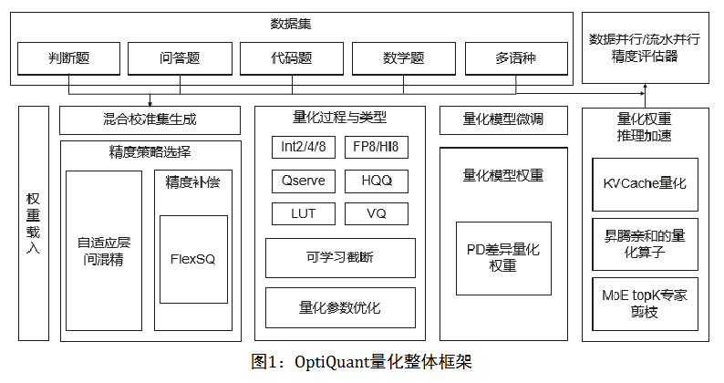
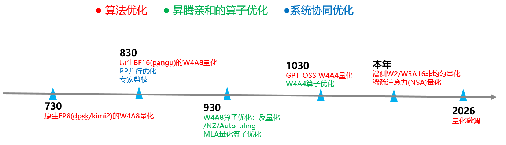

### 会议纪要

1. **Optiquant开源地址**  
   - https://gitcode.com/ascend-tribe/ascend-inference-cluster/tree/main/OptiQuant

2. **Optiquant机制分享**  
      
   - **支持多种数据类型和量化方式**：
      - 支持了Int2/4/8和FP8/HiFloat8等数据类型，支持业界的Qserve，HQQ，LUT等量化方法.
      - 在此基础上提出了可学习截断和量化参数优化等算法，进一步减少了量化误差。  

   - **支持多种数据集和混合校准集**：
      - 支持了判断题，问答题，代码题和数学题等多种测试类别，语种上支持了十种常见语言.
      - 支持混合校准集的方法，通过一定的比例混合不同数据集的内容，提升模型量化过程中的泛化性。
  
   - **量化权重生成**：  
     - 提出了自适应层间混精算法，并且根据对应的量化配置生成对应的权重参数，通过去冗余技术减少参数保存的参数量.
     - 进一步提出了FlexSQ等算法，在数据校准过程中，对大模型激活异常值进行了平滑处理，有助于对激活做低比特量化。

3. **未来计划**
   

4. **社区协作**  
   - 鼓励更多开发者加入SIG，共同推进升腾平台上的`quant`加速技术。
   - 每两周召开例会（周六，时间待定），通过Gitee仓库和微信群跟踪进展与讨论。  

### 会议录屏

下次会议开始支持会议录屏